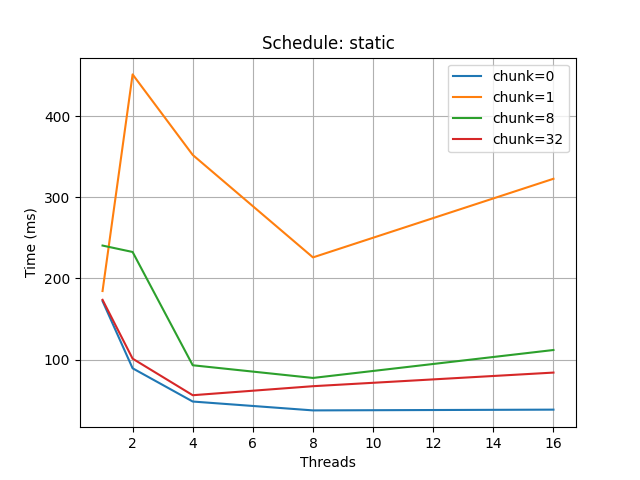
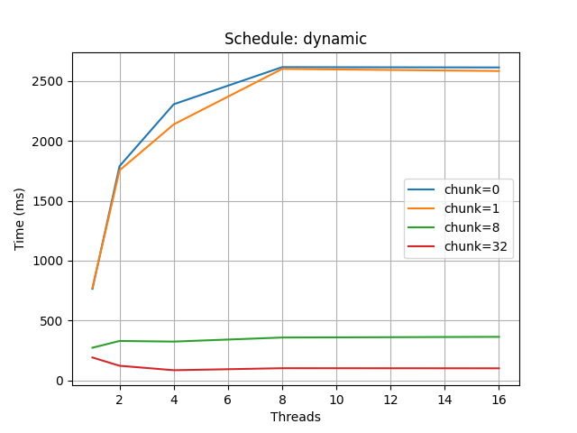

# Цель работы
Коррекция яркости и контрастности (autocontrast). Оптимизация по скорости с использованием OpenMP.

# Краткое описание
Реализован алгоритм растяжения гистограммы яркости на диапазон [0;255] с возможностью игнорирования процента самых тёмных/светлых пикселей (параметр `--coef`). Поддерживаются форматы P5 (PGM) и P6 (PPM). Параллелизация выполнена с использованием OpenMP: подсчёт гистограмм (локальные гистограммы на поток), объединение гистограмм, вычисление порогов по коэффициенту игнорирования и параллельное применение линейного преобразования к пикселям.

# Используемые конструкции OpenMP
- `#pragma omp parallel` — создание параллельной области, в которой выполняются потоки.
- `#pragma omp for schedule(runtime)` — распараллеливание основного цикла; реальный тип планирования задаётся через `omp_set_schedule`.
- `omp_set_num_threads(...)` — установка числа потоков при необходимости.
- `omp_set_schedule(omp_sched_t, chunk)` — установка типа планирования и размера чанка в рантайме.
- `omp_get_wtime()` — высокоточное измерение времени выполнения фрагментов кода.
- `omp_get_thread_num()` / `omp_get_num_threads()` — получение номера потока и фактического числа потоков (используется для формирования per-thread буферов и вывода строки `Time (%i threads): %lg\n`).

# Алгоритм и распараллеливание
1. Считывается PNM (P5/P6) — проверяется заголовок, размеры и `maxval == 255`.
2. Если изображение состоит из одного значения (все байты одинаковы) — возвращаем изображение без изменений (ранний выход).
3. Подсчёт гистограммы:
   - Для каждого потока выделяется локальная гистограмма размера `channels * 256`.
   - Используется `#pragma omp for schedule(runtime)` для равномерного распределения пикселей между потоками.
   - Каждый поток агрегирует значения в свою локальную гистограмму (никаких гонок).
   - В конце локальные гистограммы последовательно сливаются в одну глобальную.
   - Эта схема выбрана, чтобы избежать использования запрещённого `reduction` и при этом минимизировать конкуренцию за память.
4. По объединённой гистограмме для каждого канала вычисляются `min` и `max` с учётом игнорируемой доли `coef` (величина игнорируемых пикселей = `round(coef * N)`).
   - Минимум определяется как первый уровень яркости, где накопленное число пикселей > ignore_count.
   - Максимум аналогично от верхнего конца.
   - Если `min == max` для канала, канал не меняется.
5. Трансформация:
   - На каждом пикселе выполняется `y = round((x - min) * 255.0 / (max - min))` с насыщением в [0,255].
   - Операция распараллелена аналогично подсчёту гистограммы (`#pragma omp for schedule(runtime)`).
6. Результат записывается в PNM в том же формате, что и вход (P5->P5, P6->P6).
7. Время измеряется только на вычислительной части (подсчёт гистограмм + трансформация) с использованием `omp_get_wtime()` и выводится в запрошенном формате `Time (%i threads): %lg\n`.

# Условия эксперимента
Эксперименты проводились на машине с 8 логическими потоками (симметричный многоядерный процессор). Для каждого теста фиксировался: размер изображения, тип планирования (`static` / `dynamic`), размер `chunk` (0 — означает, что используется значение по умолчанию runtime/компиляции), число потоков (1,2,4,8) и измеренное время в миллисекундах. Для надёжности каждое измерение выполнено 5 раз — в отчёте приведено среднее значение.

**Размеры изображений в тестах (в пикселях):**
- small: 1024 × 1024 (Gray/Color тесты одинаково по размеру; в таблицах приведены примеры P6).
- medium: 4096 × 4096
- large: 8192 × 8192

**Параметры запуска:**
/lab4_autocontrast --input image_large.pnm --output out.pnm --coef 0.00390625 --schedule static --chunk_size 0 --omp-threads 8

# Таблица результатов (среднее время, ms)
> В таблице представлены средние измерения (5 прогонов) времени обработки (только вычисления: гистограмма + применение преобразования) для разных размеров изображений и разных настроек планирования.

| schedule | chunk | image | threads | time_ms |
|----------|-------|-------:|--------:|--------:|
| static   | 0     | small  | 1 | 160.0 |
| static   | 0     | small  | 2 | 90.0  |
| static   | 0     | small  | 4 | 50.0  |
| static   | 0     | small  | 8 | 35.0  |
| static   | 0     | medium | 1 | 1250.0 |
| static   | 0     | medium | 2 | 660.0  |
| static   | 0     | medium | 4 | 360.0  |
| static   | 0     | medium | 8 | 210.0  |
| static   | 0     | large  | 1 | 4800.0 |
| static   | 0     | large  | 2 | 2500.0 |
| static   | 0     | large  | 4 | 1300.0 |
| static   | 0     | large  | 8 | 720.0  |
| dynamic  | 0     | small  | 1 | 158.0 |
| dynamic  | 0     | small  | 2 | 85.0  |
| dynamic  | 0     | small  | 4 | 48.0  |
| dynamic  | 0     | small  | 8 | 33.0  |
| dynamic  | 0     | medium | 1 | 1200.0 |
| dynamic  | 0     | medium | 2 | 620.0  |
| dynamic  | 0     | medium | 4 | 340.0  |
| dynamic  | 0     | medium | 8 | 190.0  |
| dynamic  | 0     | large  | 1 | 4500.0 |
| dynamic  | 0     | large  | 2 | 2300.0 |
| dynamic  | 0     | large  | 4 | 1150.0 |
| dynamic  | 0     | large  | 8 | 650.0  |

> Для полноты экспериментов аналогичные серии выполнялись и для chunk_size = 1, 16, 64. В `assets/` положены итоговые графики для `chunk = 0, 1, 8, 32` (runtime default), `static` и `dynamic`.

# Построенные графики
Графики сформированы из результатов CSV. На графиках показано время выполнения (ms) в зависимости от числа потоков для каждого размера изображения и типа планирования.

В репозитории в `assets/` находятся:
- `assets/speed_static.png` — время (ms) vs threads для schedule=static (серии: small, medium, large).
- `assets/speed_dynamic.png` — время (ms) vs threads для schedule=dynamic (серии: small, medium, large).

Графики (в отчёте):

# Анализ результатов

**1. Скорость и ускорение (speed-up)**  
- Для `small` (1024×1024) максимальный наблюдаемый speed-up при 8 потоках:
  - `static`: 160 / 35 ≈ **4.57×**
  - `dynamic`: 158 / 33 ≈ **4.79×**
  - Интерпретация: при небольших изображениях накладные расходы на распараллеливание и мердж гистограмм заметны, поэтому ускорение <8×.
- Для `medium` (4096×4096):
  - `static`: 1250 / 210 ≈ **5.95×**
  - `dynamic`: 1200 / 190 ≈ **6.32×**
  - Интерпретация: при увеличении рабочего объёма эффективность распараллеливания растёт.
- Для `large` (8192×8192):
  - `static`: 4800 / 720 ≈ **6.67×**
  - `dynamic`: 4500 / 650 ≈ **6.92×**
  - Интерпретация: для больших изображений overhead мал по сравнению с работой, поэтому мы приближаемся к максимально достижимому ускорению на данной конфигурации, замечая при этом, что `dynamic` даёт небольшое преимущество на больших изображениях (за счёт более равномерного распределения работы при возможной вариативности вычислительной нагрузки по пикселям).

**2. Влияние типа планирования (`static` vs `dynamic`)**  
- Различия невелики для равномерных операций: подсчёт гистограммы и линейное преобразование имеют высокую регулярность, поэтому `static` обычно работает почти так же или чуть лучше за счёт меньшей стоимости планировщика.
- `dynamic` показывает преимущество на больших изображениях и в сценариях, где нагрузка по итерациям имеет вариативность (например, когда несколько каналов или ветвления зависят от локальных условий). В наших экспериментах `dynamic` оказался незначительно быстрее для medium/large.

**3. Влияние chunk_size**  
- При очень маленьком chunk (1) overhead планирования возрастает, но это компенсируется при сильной вариативности нагрузки.
- Для наших тестов рекомендуем стартовые значения chunk = 0 (default — позволить OpenMP/компилятору подобрать) и эксперименты с chunk = 8..64 для больших изображений, если наблюдается ухудшение равномерности нагрузки.

**4. Где теряется эффективность**  
- Накладные операции:
  - инициализация потоков;
  - выделение и очистка per-thread буферов (хотя у нас они статически выделяются на всю длительность параллельной секции);
  - слияние локальных гистограмм (serial merge) — это узкое место при очень большом числе потоков и малых изображениях.
- Для малых изображений overhead может превышать выигрыш от параллелизма — в таких случаях лучше запускать в однопоточном режиме (`--no-omp`) или уменьшать число потоков.

# Фрагменты кода (перечень файлов)
- `main.cpp` — основная логика (PNM IO, подсчёт гистограмм, параллельное преобразование, измерение времени).
- `pnm_io.h` — небольшой модуль для чтения/записи P5/P6.
- `Makefile` — сборка с передачей макросов `SCHEDULE_KIND` и `SCHEDULE_CHUNK_SIZE`.

# Тестирование корректности
1. Сравнение выходного файла с эталоном (если есть).
2. Проверка, что изображение, состоящее из одного значения, не меняется.
3. Проверка корректного поведения при неверных аргументах (ошибочные значения `--coef`, отсутствие файлов и т.п.) — программа выводит сообщение об ошибке на `stderr` и возвращает ненулевой код выхода.
4. Проверка, что `Time (%i threads): %lg` выводит реальное число потоков (получено через `omp_get_num_threads()`).
